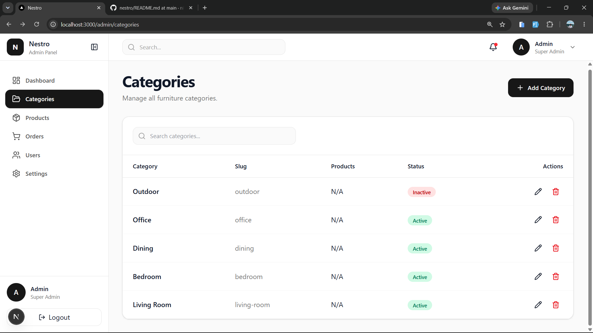
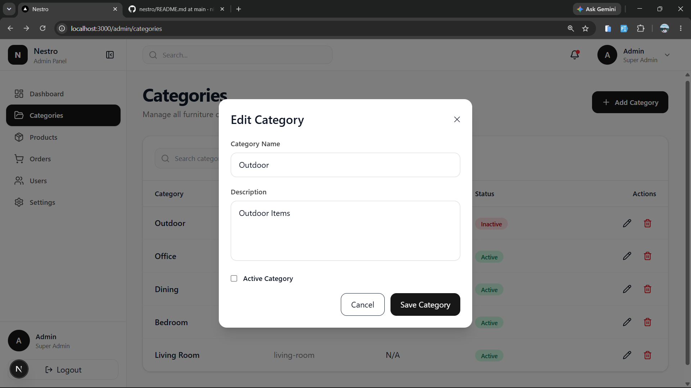

# Nestro


> 🚧 **Nestro is currently under active development.**
>
> Nestro is a production-style furniture e-commerce platform that I'm building to learn professional full-stack software engineering while creating a portfolio-quality project. Every feature is developed with scalability, clean architecture, and industry best practices in mind.

---

# 📖 About the Project

Nestro is more than just another CRUD application.

It is my long-term learning project where I practice building software the way professional development teams do.

Instead of rushing to finish features, I focus on:

- Clean Architecture
- Reusable Components
- Production Folder Structure
- REST API Design
- Scalable Backend Development
- Professional Git Workflow
- Documentation
- Real-world Development Practices

The goal is to build an application that demonstrates not only technical skills but also software engineering thinking.

---

Nestro is being designed as a unified commerce platform rather than a single application.

The long-term vision consists of multiple client applications sharing a common backend.

Current architecture includes:

- Admin Application
- Customer Store (planned)

Future expansion may include:

- Seller Portal
- Mobile Application
- Public API

This approach allows the platform to grow while keeping business logic centralized inside a shared backend.

---

# 🎯 Project Goals

Through Nestro, I aim to learn and practice:

### Frontend

- Next.js App Router
- React
- Tailwind CSS
- Component Architecture
- State Management
- API Integration
- Reusable UI Components

### Backend

- Express.js
- MongoDB
- Mongoose
- REST API Design
- Middleware
- Authentication
- Authorization
- File Upload

### Software Engineering

- Clean Code
- Separation of Concerns
- Scalable Folder Structure
- Documentation
- Git Workflow
- Deployment
- Production-Level Development Practices

---

# 🛠 Tech Stack

## Frontend

- Next.js (App Router)
- React
- Tailwind CSS v4
- Axios
- Sonner
- Lucide React
- clsx
- React Hook Form
- Zod Validation

---

## Backend

- Node.js
- Express.js v5
- MongoDB
- Mongoose
- dotenv
- cors
- nodemon
- Zod (request validation)
- Multer
- Cloudinary (image upload & storage)
- helmet
- express-rate-limit
- bcryptjs (password hashing)
- jsonwebtoken (JWT authentication)
- cookie-parser

---

## Testing

- Jest
- Supertest
- mongodb-memory-server (in-memory MongoDB for integration tests — never touches real data)

---

## Planned Integrations

- Refresh Tokens

---

# 📸 Screenshots

> Screenshots will be added as the project progresses.

### Admin Dashboard

Coming Soon

---

### Categories Module

#### Categories List



Browse, search, edit and manage furniture categories from the admin panel.

---

#### Create / Edit Category



A reusable form used for both creating and updating categories.

---

### Product & Variant Management

#### Backend

- Create Product
- Get All Products (with populated category, brand, room types, and a computed variant count)
- Get Product By ID
- Update Product
- Delete Product — cascade-aware: blocks with a variant count if the product has variants, requires explicit confirmation to delete the product and all its variants together
- Create Product Variant
- Get All Variants for a Product
- Get Variant By ID
- Update Variant
- Delete Variant
- Referential Integrity — Category, Brand, Room Type, Material, and Color cannot be deleted while a Product or Variant still references them
- Auto-generated, Collision-safe SKUs — built from the product, material, and color, disambiguated with a document ID fragment rather than relying on truncated names staying unique
- Compound Uniqueness — a Product cannot have two variants with the same material and color
- Money stored as Integer Minor Units (paise), never floats
- Cloudinary Cleanup on Delete and Image Replacement — for both products and variants
- Route-level ObjectId Validation
- Reference-existence Validation (not just ID format) on create and update
- Proper Error Handling
- RESTful API Structure

#### Frontend

- Products Listing with Search, Sort, Pagination
- Create Product
- Edit Product
- Cascade-aware Delete Confirmation — shows the exact variant count before deleting a product with variants
- Dedicated Create/Edit Routes (not a modal, since a Product is a composite entity with its own variants)
- Variant Management Page per Product
- Variant Create/Edit Modal
- Multi-image Gallery with a configurable per-entity image cap
- Room Type Multi-select
- Specification Key/Value Editor
- Guided "first variant" prompt immediately after creating a product
- Shared Form Validation Pattern (React Hook Form + Zod), mirrored on the backend
- Loading States
- Error Handling
- Toast Notifications

---

### Authentication & Authorization

#### Backend

- User Model with bcrypt-hashed passwords (never stored or returned in plain text)
- JWT-based Authentication delivered via an httpOnly cookie (not readable by client-side JavaScript, not stored in localStorage)
- Register, Login, Logout, and "Current User" endpoints
- Re-verifies the logged-in user against the database on every request, rather than trusting a role embedded in the token — a role change or deactivation takes effect immediately
- Role-Based Access Control — a reusable `authorize(...roles)` middleware, composed the same way across every protected route
- Every write operation (Create, Update, Delete) across every module — Categories, Room Types, Brands, Materials, Colors, Products, Variants, and Image Upload — requires a logged-in Admin; all read operations remain public
- A dedicated, stricter rate limiter on the login and register endpoints specifically, on top of the general API rate limit
- Public registration always creates a Customer account — there is no way for a self-registered user to grant themselves Admin access
- Idempotent admin-account seed script, kept deliberately separate from the Master Data seed script so reseeding test data never touches real admin accounts

#### Frontend

- Login Page (React Hook Form + Zod)
- Global Auth State via React Context (checks for an existing session on load)
- Route Guard on the Admin Panel — redirects to Login unless a logged-in Admin is confirmed
- Logout, wired into the Admin Header
- Register Page — not yet built; deferred until the Customer Store exists for a customer to actually register through

---

# 🏗 Architecture

```
                    NESTRO

          ┌──────────────────────┐
          │                      │

          ▼                      ▼

   Admin Application     Customer Store

          │                      │

          └─────────┬────────────┘
                    │

            Express REST API

                    │

     ┌──────────────┴──────────────┐

     ▼                             ▼

Business Logic              Shared Middleware

                    │

               MongoDB Models

                    │

                 MongoDB

```

Both the Admin Application and the Customer Store communicate with the same backend API.

The backend is designed as the single source of truth for business logic, authentication, inventory, products and future commerce features.

---

# 📁 Project Structure

```

Nestro/
│
├── client/
│ ├── src/
│ │ ├── app/
│ │ ├── components/
│ │ ├── services/
│ │ ├── utils/
│ │ ├── lib/
│ │ └── hooks/ (future)
│
├── server/
│ ├── src/
│ │ ├── controllers/
│ │ ├── middlewares/
│ │ ├── models/
│ │ ├── routes/
│ │ ├── utils/
│ │ ├── app.js
│ │ └── server.js
│
└── README.md

```

# ✨ Features

## ✅ Completed

### Admin Dashboard

- Responsive Admin Layout
- Sidebar Navigation
- Dashboard Header
- Reusable UI Structure

---

### Category Management

#### Backend

- Create Category
- Get All Categories
- Get Category By ID
- Update Category
- Delete Category
- Duplicate Category Validation
- ObjectId Validation Middleware
- Proper Error Handling
- RESTful API Structure

#### Frontend

- Categories Listing
- Create Category
- Edit Category
- Delete Category
- Shared Create/Edit Modal
- Shared Category Form
- Delete Confirmation Modal
- Loading States
- Error Handling
- Toast Notifications
- Axios Service Layer

### Room Type Management

#### Backend

- Create Room Type
- Get All Room Types
- Get Room Type By ID
- Update Room Type
- Delete Room Type
- Duplicate Room Type Validation
- ObjectId Validation Middleware
- Proper Error Handling
- RESTful API Structure

#### Frontend

- Room Types Listing
- Create Room Type
- Edit Room Type
- Delete Room Type
- Shared Create/Edit Modal
- Shared Room Type Form
- Delete Confirmation Modal
- Loading States
- Error Handling
- Toast Notifications
- Axios Service Layer

### Brand Management

#### Backend

- Create Brand
- Get All Brands
- Get Brand By ID
- Update Brand
- Delete Brand
- Duplicate Brand Validation
- ObjectId Validation Middleware
- Proper Error Handling
- RESTful API Structure

#### Frontend

- Brands Listing
- Create Brand
- Edit Brand
- Delete Brand
- Shared Create/Edit Modal
- Shared Brand Form
- Delete Confirmation Modal
- Loading States
- Error Handling
- Toast Notifications
- Axios Service Layer

### Material Management

#### Backend

- Create Material
- Get All Materials
- Get Material By ID
- Update Material
- Delete Material
- Duplicate Material Validation
- ObjectId Validation Middleware
- Proper Error Handling
- RESTful API Structure

#### Frontend

- Materials Listing
- Create Material
- Edit Material
- Delete Material
- Shared Create/Edit Modal
- Shared Material Form
- Delete Confirmation Modal
- Loading States
- Error Handling
- Toast Notifications
- Axios Service Layer

### Color Management

#### Backend

- Create Color
- Get All Colors
- Get Color By ID
- Update Color
- Delete Color
- Duplicate Color Validation
- Route-level ObjectId Validation
- Proper Error Handling
- RESTful API Structure

#### Frontend

- Colors Listing
- Create Color
- Edit Color
- Delete Color
- Shared Create/Edit Modal
- Shared Color Form
- Delete Confirmation Modal
- Loading States
- Error Handling
- Toast Notifications
- Axios Service Layer

---

### Reusable Architecture

- Service Layer Pattern via a Shared Service Factory (`createResourceService`) — every Master Data module's CRUD service is generated from one function instead of hand-written per module
- Shared CRUD Hook (`useCrud`) — all state, handlers, search/sort/filter/pagination logic for every Master Data admin page lives in one hook
- Shared Query Builder (`buildQueryFeatures`) — backend search, sort, and filter logic built once and reused across all 5 controllers, backed by a MongoDB text index rather than a regex scan
- Shared Search, Sortable Columns, Status Filter, and Pagination UI — one component each, reused across every Master Data table
- Reusable Delete Confirmation Modal
- Reusable Empty State Component
- Shared Axios Instance
- Reusable Validation Middleware
- Shared Text Formatter Utilities
- Feature-based Folder Structure
- Shared Form Validation Pattern (React Hook Form + Zod)
- Database Seed Script for local development/testing

---

### Hardening Pass

A full correctness and security review of the backend, completed before starting the Product module:

- Regex-based input escaped everywhere it reaches a database query, preventing false matches and catastrophic backtracking
- Pagination limits capped, and sortable fields whitelisted against arbitrary query input
- CORS restricted to known origins, with helmet and rate limiting added at the API boundary
- Required environment variables validated at boot, failing fast instead of failing silently
- Orphaned Cloudinary images cleaned up automatically on delete and on image replace
- Slug collisions resolved with a numeric suffix instead of silently colliding
- Search moved from an unindexed regex scan to a MongoDB text index

---

### Automated Testing

53 Jest + Supertest integration tests across every backend module (Categories, Room Types, Brands, Materials, Colors, Products, Variants, and Authentication), covering the main success path and the most likely failure path for each route:

- Runs against an in-memory MongoDB (`mongodb-memory-server`) that exists only for the duration of the test run — real data is never touched
- Explicit coverage for the authorization layer itself: an unauthenticated request and a wrong-role request are both tested against a protected route, not just the "happy path"
- Introduced incrementally alongside each module rather than deferred to the end

---

# 🚀 Roadmap

## Phase 1 — Admin Foundation

- ✅ Admin Dashboard
- ✅ Categories
- ✅ Room Types
- ✅ Brands
- ✅ Materials
- ✅ Colors
- ✅ Image Upload
- ✅ Search, Pagination, Sorting, Filtering
- ✅ Error Handling Improvements
- ✅ Hardening Pass (security, data integrity, and correctness review)

---

## Phase 2 — Product Management

- ✅ Products
- ✅ Product Variants
- ✅ Product Gallery
- Inventory
- Stock Management (basic stock + low-stock threshold is in; a dedicated Inventory entity is deferred)
- ✅ Pricing
- ✅ Product Status

---

## Phase 3 — Customer Store

- Home Page
- Product Listing
- Product Details
- Search
- Filters
- Wishlist
- Shopping Cart

---

## Phase 4 — Platform

- ✅ Authentication (backend + frontend)
- ✅ Authorization / RBAC (backend)
- ✅ Admin
- ✅ Login / Register UI (Login done; Register deferred to the Customer Store phase)
- Customer Accounts (registration exists on the backend; account management UI not yet built)
- Super Admin (deliberately deferred — no real use case yet with a single admin)

---

## Phase 5 — Commerce

- Checkout
- Address Management
- Payment Integration
- Orders
- Order Tracking

---

## Phase 6 — Platform Expansion

- Seller Portal
- Marketplace Support
- Reports
- Analytics
- Mobile API

---

## Phase 7 — Dashboard & Analytics

- Sales Dashboard
- Reports
- Charts
- Business Analytics

---

# ⚙️ Getting Started

## Clone the Repository

```bash
git clone https://github.com/nikhil-nikkx7890/nestro.git
```

---

## Install Dependencies

### Client

```bash
cd client
npm install
```

### Server

```bash
cd server
npm install
```

---

## Configure Environment Variables

### Server

Create a `.env` file inside the `server` directory.

```env
PORT=5000
MONGO_URI=your_mongodb_connection_string
CLIENT_URL=http://localhost:3000
CLOUDINARY_CLOUD_NAME=your_cloudinary_cloud_name
CLOUDINARY_API_KEY=your_cloudinary_api_key
CLOUDINARY_API_SECRET=your_cloudinary_api_secret
JWT_SECRET=a_long_random_secret_string
JWT_EXPIRES_IN=7d
```

---

### Client

Create a `.env.local` file inside the `client` directory.

```env
NEXT_PUBLIC_API_URL=http://localhost:5000/api
```

---

## Run the Application

### Backend

```bash
cd server
npm run dev
```

### Frontend

```bash
cd client
npm run dev
```

Open:

```
http://localhost:3000
```

to view the application.

# 📚 Learning Journey

Nestro is my long-term learning project where I document my journey of becoming a Full Stack MERN Developer.

Every completed module helps me practice:

- Software Architecture
- Clean Code
- REST API Development
- React & Next.js
- Express.js
- MongoDB
- Production Folder Structure
- Git & GitHub Workflow
- Documentation
- Scalable Application Design

Rather than only focusing on building features, I aim to understand the reasoning behind every architectural and engineering decision.

---

# 📈 Current Progress

## Project Status

🟢 Backend Foundation

🟢 Admin Dashboard

🟢 Category Management

🟢 Room Type Management

🟢 Brand Management

🟢 Material Management

🟢 Colors

🟢 Master Data Foundation Complete

🟢 Image Upload

🟢 Search, Pagination, Sorting, Filtering

🟢 Error Handling Improvements

🟢 Hardening Pass (security & data integrity)

🟢 Product & Variant Management

🟢 Authentication & Authorization (Backend + Frontend)

🟢 Automated Testing (53 Jest/Supertest tests)

⚪ Customer Store

⚪ Orders

⚪ Dashboard & Analytics

---

# 🧠 Engineering Principles

This project follows a few core principles throughout development:

- Think before coding.
- Build one complete feature at a time.
- Prefer clean architecture over shortcuts.
- Keep components reusable but avoid premature abstraction.
- Test every feature before committing.
- Keep documentation synchronized with development.
- Follow meaningful Conventional Commits.
- Learn every concept before moving to the next one.
- Build the foundation before introducing complexity.
- Make architectural decisions intentionally and document them.
- Introduce reusable abstractions only after multiple proven implementations.

---

# 🤝 Contributing

This project is currently a personal learning and portfolio project.

Suggestions, feedback, and discussions are always welcome.

If you have ideas for improving the architecture or implementation, feel free to open an issue or start a discussion.

---

# 👨‍💻 Author

**Nikhil Choudhary**

- GitHub: https://github.com/nikhil-nikkx7890
- LinkedIn: https://www.linkedin.com/in/nikhil-choudhary-27b2b83b9/

---

## ⭐ If you find this project interesting, consider giving it a star.

It motivates me to continue improving Nestro and documenting my journey as I build a production-style furniture e-commerce application.
